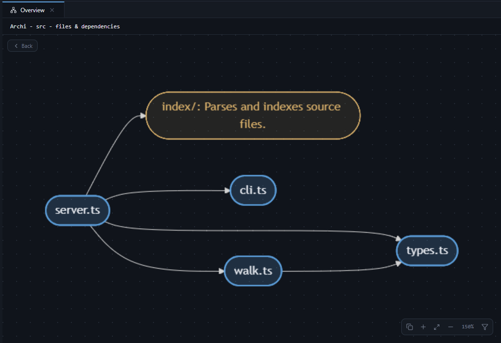

# Archiviz

Local-first, deterministic code architecture explorer. Everything runs on your machine. Optional AI adds human-readable labels - your code never leaves the device, only an anonymous graph summary is sent for labeling.



```bash
npx @nacermissouni23/archiviz /path/to/your/project
```

Then open **http://127.0.0.1:4840** (opens automatically).

---

## What it does

```text
npx @nacermissouni23/archiviz <folder>
   ↓
localhost web app
   ↓
Index codebase (multiple engines, see below)
   ↓
Deterministic code graph
   ↓
Interactive explorer:  graph + tree side by side
   ↓
Drill down:  Repository → Folder → File → Class → Function → source code
```

- Click any node to see its **callers**, **callees**, and definition location.
- Click a file in the tree to see its symbols and read-only source.
- `Ctrl+K` searches symbol names and full-text code.
- Edited your code? Hit refresh / re-run - Archiviz re-indexes on demand.

## Supported languages

Archiviz uses **four indexing engines** to cover 36 languages:

| Engine | Languages | Indexing quality |
|--------|-----------|-----------------|
| **TS LanguageService** | TypeScript, JavaScript | Full - symbols, imports, type-checked call edges, env vars, route detection |
| **Pyright LSP** | Python | Full - symbols, imports, type-checked call edges |
| **Gopls LSP** | Go | Full - symbols, imports, call edges |
| **Tree-sitter WASM** | C, C++, C#, Rust, Ruby, PHP, Kotlin, Swift, Java, Dart, Elixir, Elm, Lua, Objective-C, OCaml, Scala, Zig, Bash, Solidity, ReScript, and more | AST-based - symbols, imports, call edges |

**Manifest parsers** also detect dependencies from: `package.json`, `requirements.txt`, `pyproject.toml`, `go.mod`, `pom.xml`, `build.gradle`, `Cargo.toml`, `composer.json`, `Gemfile`, `*.csproj`.

> If the source code says it, Archiviz knows it. If Archiviz doesn't know it, it doesn't invent it.

## The five levels of understanding

Archiviz indexes your code once and derives five progressive views:

| Level | View | What it shows |
|-------|------|---------------|
| **L0** | Repository Brief | One-paragraph summary + key files |
| **L1** | System Context | External dependencies, env vars, confidence ratings |
| **L2** | Component Overview | Folder structure, language breakdown, symbol counts |
| **L3** | Dependencies | Import graph - who depends on whom |
| **L4** | Execution Trace | Entry points, call chains, route flows |
| **L5** | Symbol Inspector | Click any symbol - callers, callees, definition |

## AI annotations (optional)

```bash
# add your Gemini key once (stored in ~/.archi/config.json)
# get a key at https://aistudio.google.com/app/apikey
ARCHI_AI_KEY=AIza... archiviz /path/to/project
# or set it in .env / ~/.archi/config.json via the Settings UI
```

One merged AI call per indexing (~5k chars) annotates all three views: Component Overview, System Context, and Repository Brief. If the key is missing or invalid, Archiviz works fully with deterministic plain labels. Badges show `AI annotating…` → `AI annotated` or `AI failed: <reason>` (hover for details). Only Google AI Studio API keys are supported for now.

**Privacy:** Archiviz builds the graph locally. Only the graph summary (folder names, top symbols, system kinds - no file contents) is sent to Google for labeling. See Settings for details.

## CLI options

```text
archiviz [path]         folder to index immediately
archiviz --port 5000    custom port (default 4840)
archiviz --no-open      don't auto-open the browser
# archi works too as an alias
```

You can also start without a path (`npx @nacermissouni23/archiviz`) and paste one into the UI.

## Architecture

```text
CLI (bin/archi.js)
  └── Fastify server (src/server.ts)
        ├── Indexers
        │     ├── FileWalker - walks files, skips node_modules/.git/etc, respects .gitignore
        │     ├── TsIndexer - TypeScript/JavaScript (TS LanguageService)
        │     ├── PyEngine - Python (pyright LSP over JSON-RPC)
        │     ├── GoEngine - Go (gopls LSP over JSON-RPC)
        │     └── TreeSitterEngine - 32 languages (web-tree-sitter WASM)
        ├── Manifests - parses package.json, requirements.txt, go.mod, pom.xml, etc.
        ├── GraphStore - in-memory graph (nodes + edges), callersOf/calleesOf queries
        ├── Context - SYSTEM_SIGNATURES for 50+ frameworks/libraries
        ├── REST API (/api/repos/:id/...)
        └── Static React app (Vite + React + React Flow + Mermaid)
```

Key design decisions:

- **In-memory only** - no database, no persistence. Re-index on demand.
- **Zero network calls** - everything runs locally. No telemetry.
- **Deterministic** - same code + same engine = same graph, every time.
- **Confidence-rated** - HIGH = imported in indexed code; MED = env-var-only or manifest-declared-only.

## Project structure

```text
archi/
  bin/archi.js           CLI entry point
  src/
    cli.ts               CLI argument parsing
    server.ts            Fastify server, routes, reindex pipeline
    types.ts             Shared types
    walk.ts              File walker (skips node_modules, .git, etc.)
    index/
      tsIndexer.ts       TypeScript/JavaScript indexer
      pyEngine.ts        Python LSP engine (pyright)
      goEngine.ts        Go LSP engine (gopls)
      lsp.ts             Generic LSP client (JSON-RPC over stdio)
      treeSitterEngine.ts Tree-sitter WASM engine (32 languages)
      manifests.ts       Manifest parsers (10+ formats)
      store.ts           GraphStore - in-memory graph
      context.ts         SYSTEM_SIGNATURES, LABEL_OVERRIDES, matchSystemKind()
      brief.ts           L0: repository brief generation
      narrative.ts       L1: system context narrative
      overview.ts        L2: component overview
      trace.ts           L4: execution trace
  web/
    src/
      App.tsx            Main app layout
      Sidebar.tsx        File tree + search
      Inspector.tsx      Symbol inspector (L5)
      DepsView.tsx       Dependency graph (L3)
      TraceView.tsx      Execution trace (L4)
      TracePickerView.tsx Trace entry point picker
      CodeView.tsx       Read-only source viewer
      components/
        BriefView.tsx    L0: repository brief
        ContextView.tsx  L1: system context
        OverviewView.tsx L2: component overview
        SettingsModal.tsx Settings UI
```

## Development

```bash
# install deps
npm install
cd web && npm install && cd ..

# build everything (server + frontend)
npm run build

# start the server
npm start

# or run in dev mode (hot reload)
npm run dev

# frontend dev server (proxies /api to backend)
cd web && npm run dev
```

## What's next

- More languages and framework signatures
- `archiviz --watch` live re-index
- Export (PNG/SVG, JSON graph)
- See `CHANGELOG.md` and [GitHub Discussions](https://github.com/nacermissouni23/Archiviz/discussions)

## Contributing

Archiviz is open source (MIT). Contributions welcome.

1. Fork the repo
2. Create a feature branch (`git checkout -b feature/my-feature`)
3. Make your changes
4. Run `npm run build` to verify
5. Open a PR

**Adding a new language:**

1. Add a tree-sitter grammar to `src/index/treeSitterEngine.ts`:
   - Add a `LANGUAGES` entry with `symbolTypes`, `importType`, `callTypes`, `kindFromNode`
   - Add file extension mappings to `EXT_LANG`
2. If the language has popular frameworks, add entries to `SYSTEM_SIGNATURES` in `src/index/context.ts`
3. Test against a real project in that language

**Adding framework awareness:**

Add entries to `SYSTEM_SIGNATURES` in `src/index/context.ts`. Each entry maps a package name to its known symbols (classes, functions, constants). This enables Archiviz to recognize framework calls even when the framework source isn't indexed.

## License

MIT
